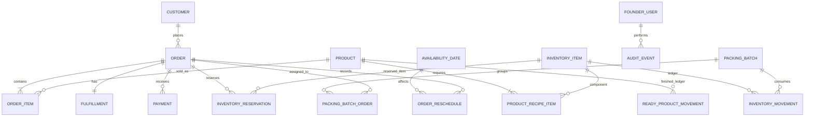

# Architecture

[← Technical spec hub](../technical-spec.md)

**Implementation: ✅ MOSTLY BUILT** — the Next.js/TypeScript monolith is deployed on Vercel with Supabase PostgreSQL and Drizzle ORM. Core domain state, domain actions, and Founder OS auth are implemented. See [implementation-status.md](../implementation-status.md) for detailed status of individual components.

## 2. System boundaries

### 2.1 Public storefront

The public storefront lets a customer:

- view the two active products;
- switch between Bahasa Indonesia and English;
- select quantities;
- choose Mandiri pickup, BI pickup, or external delivery;
- see the promised ready date before submission;
- provide name, WhatsApp number, and conditional delivery address;
- place an order without an account or mandatory payment;
- view confirmation and optional static QRIS payment instructions.

### 2.2 Founder OS

Founder OS lets either founder:

- see operational attention items;
- manage orders through the three fulfillment states;
- inspect and complete packing batches;
- manage availability and pause the store;
- receive stock, inspect material requirements, and perform stock opname;
- verify and record payments;
- see receivables and basic financial summaries;
- search order and movement history.

### 2.3 External systems

V1 may link to or rely on:

- WhatsApp deep links for founder-initiated customer communication;
- founders' banking and QRIS merchant apps for manual payment verification;
- a public-holiday dataset or founder-maintained holiday list.

No external system is an accounting or inventory source of truth in V1.

---

## 3. High-level architecture

### 3.1 Minimum deployable architecture

**REQUIRED:** Deploy the responsive web application and its server-side application functions on Vercel. Vercel is the application hosting and deployment platform, not the database system.

**REQUIRED:** Use Vercel Hobby only during development and non-commercial testing. Production release is blocked until the project is upgraded to Vercel Pro. "Production release" means enabling the public storefront to accept a real customer order for financial gain, regardless of traffic volume.

**REQUIRED:** Implement the storefront and Founder OS as one Next.js application written in TypeScript. Use the framework's server-side capabilities for domain commands and protected founder operations rather than creating a separate backend application.

**REQUIRED:** Use Supabase PostgreSQL as the managed relational database. Locate the Supabase project as close as practicable to the Vercel function region. Authentication, storage, and the data-access library remain explicit follow-up decisions.

**REQUIRED:** Use Drizzle ORM with a server-side PostgreSQL driver for type-safe queries and transactions. Connect Vercel functions through the Supabase connection pooler using the provider-recommended serverless settings. Keep generated SQL migrations in version control and review them before application. Never use schema push directly against production.

```text
Customer browser ─┐
                  ├─ Vercel web application ─ Vercel server functions ─ Supabase PostgreSQL
Founder browser ──┘                                  │
                                                     ├─ Static asset storage
                                                     └─ Prefilled WhatsApp link generator
```

The web application may use server-rendered pages, client rendering, or a hybrid. The choice does not change the domain model. Use Vercel's Local, Preview, and Production environments for development, review, and live releases.

### 3.2 Components

| Component | Responsibility |
|---|---|
| Next.js storefront UI | Product selection, fulfillment, customer details, confirmation |
| Next.js Founder UI | Dashboard, Kanban, packing, inventory, payments, availability |
| Next.js server layer | Validation, scheduling, transactions, authorization |
| Supabase PostgreSQL + Drizzle | Orders, ledgers, reservations, availability, audit history, transactional access |
| Next.js static assets | Version-controlled product/brand images, QRIS image, and interface assets deployed through Vercel |
| WhatsApp link generator | Build encoded, prefilled messages and open the customer's WhatsApp conversation |

### 3.3 Explicitly unnecessary in V1

- microservices;
- event-streaming infrastructure;
- Redis or a separate cache;
- search engine;
- data warehouse;
- customer identity provider;
- payment gateway;
- native mobile applications.

---

## 4. Local development and testing

See [dev-workflow.md](./dev-workflow.md) for the persona dispatch loop, Playwright review kit usage, startup checklist, pre-commit documentation gate, throwaway founder credentials, and the shared-database warning for local dev.

---

## 5. Domain relationship map



### 5.1 Aggregate boundaries

- **Order aggregate:** order, items, fulfillment, captured totals, status, reservations.
- **Inventory aggregate:** item, movements, reservations, derived balances.
- **Ready-product aggregate:** product, append-only finished-unit movements, derived ready-to-sell balance.
- **Packing aggregate:** date-based batch, included orders, completion event.
- **Availability aggregate:** date overrides and global store status.
- **Payment aggregate:** one or more payments associated with an order.

---

## 6. Data conventions

### 6.1 Identifiers

- Internal primary keys: UUID or database-native equivalent.
- Customer-facing order number: immutable sequential display value such as `LN-0027`.
- Do not use the public order number as the database primary key.

### 6.2 Money

- Store all money as integer rupiah.
- Never use binary floating point for money.
- Capture unit selling price on each `order_item`; do not derive historical revenue from the current product price.
- Capture acquisition unit cost on inventory receipt movements.

### 6.3 Quantities

- Packaging items use integer pieces.
- Raw cheese uses decimal grams.
- **REQUIRED:** store every persisted raw-cheese quantity as `numeric(..., 2)` with 0.01 g precision for consistent accounting across pooled cheese stock, supplier receipt batches, and historical audit trails.
- Use decimal arithmetic and standard half-up rounding once at each persisted reservation or movement boundary. Never use binary floating-point or rounded display values for inventory calculations.
- Founder-facing summaries may show whole grams, kilograms, or approximate pack equivalents; detailed history retains the two-decimal gram value.

### 6.4 Dates and timestamps

- Persist timestamps as UTC instants.
- Render and calculate business dates in `Asia/Jakarta`.
- Persist promised and current ready dates as local business dates, not timestamps.
- Every table with mutable state should have `created_at` and `updated_at`.

### 6.5 Deletion

- Orders, inventory movements, payments, packing completions, and audit events are never hard-deleted through normal application behavior.
- Cancellation or reversal uses explicit status or compensating entries.
- Product and inventory master data may be deactivated rather than deleted once referenced.
